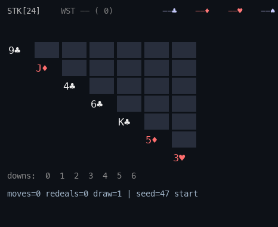
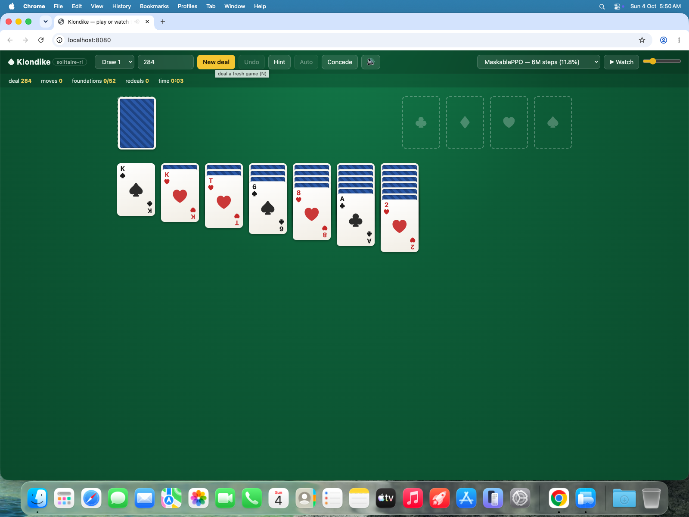
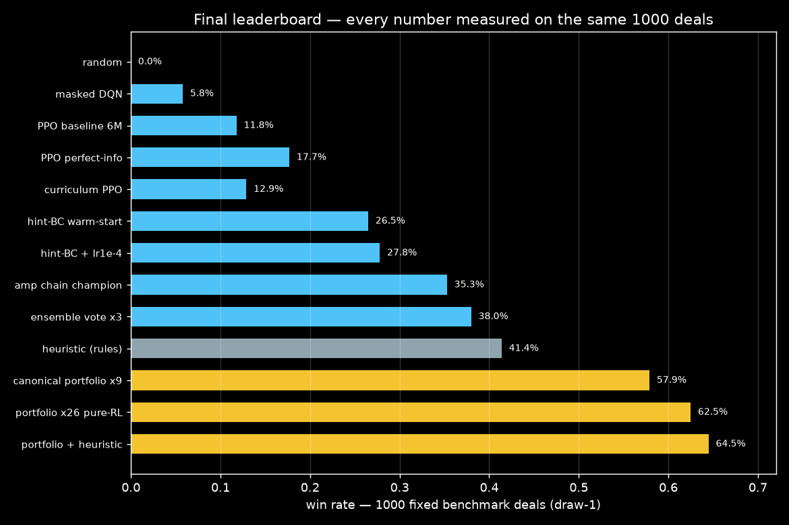
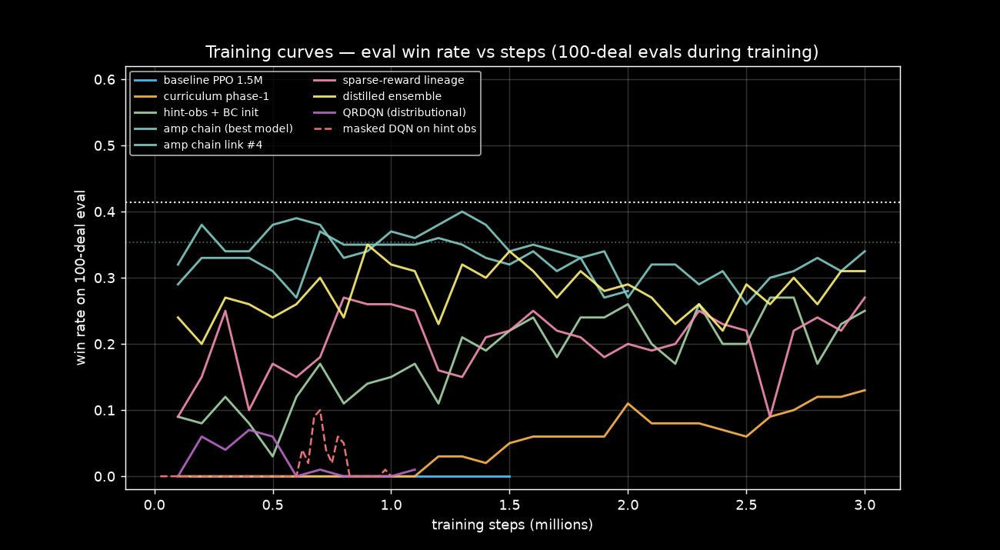
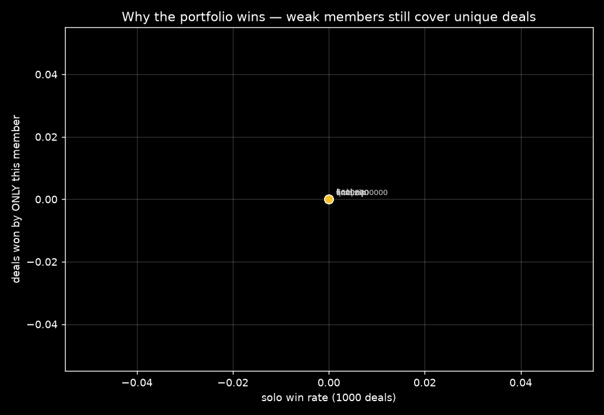

# solitaire-rl

[](https://github.com/Matthew-Eucaristo/solitaire-rl/actions/workflows/tests.yml)
[](LICENSE)


Reinforcement-learning agents that learn to play **Klondike Solitaire** from
raw game state — no vision, no pixels, state vectors + legal-move masking —
evaluated fairly on a fixed set of 1000 deals against a deterministic
heuristic baseline.



## Play it in your browser



```bash
./run_web.sh    # one command: uv syncs deps, then serves on :8080
```

Open http://localhost:8080 — a complete Klondike game running on the **same
rules engine** as the tests and evals (no JavaScript rules port that could
diverge): drag & drop, double-click to foundation, undo, hint, concede,
sounds, draw-1 / draw-3, reproducible seeded deals.

The **Watch** button hands the live board to an agent (heuristic, masked
DQN, MaskablePPO, or perfect-info PPO). Its env is rebuilt by replaying the
game's action history with the policy's own observation variant — what you
watch is exactly what was benchmarked. Winning deals to try with PPO:
**284, 118, 161, 211**.

## Results — fixed benchmark, 1000 deals (seeds 0–999)

| Policy | Observation | Draw-1 | Draw-3 |
|--------|-------------|--------|--------|
| random_legal | — | 0.0% | 0.0% |
| **heuristic** (rule-based) | — | **41.4%** | **11.8%** |
| masked DQN (250k steps) | compact | 5.8% | — |
| MaskablePPO (6M steps) | compact POMDP | 11.8% | — |
| MaskablePPO (6M steps) | compact, perfect info | 17.7% | — |
| PPO + BC warm-start (3M) | compact + hint | 26.5% | — |
| PPO amplified chain (~8M) | compact + hint | 35.3% | — |
| Ensemble vote ×3 | compact + hint | 38.0% | — |
| **Portfolio ×26 RL** (best-of-N, declared) | compact + hint | **62.5%** | — |
| Portfolio + heuristic member | compact + hint | 64.5% | — |
| Portfolio ×9 (committed ckpts) | compact + hint | 57.9% | — |

Every number comes from `eval.py` on the same fixed deal set — never a
random sample. Training deals are always seeds ≥ 1,000,000, so train and
benchmark sets are disjoint by construction. Per-run JSONs in `results/`,
all charts in `results/figs/`.





The honest takeaway (see `RESULTS.md` for per-experiment pro/contra and
`ANALYSIS.md`): Klondike is brutal for generic deep RL at laptop scale —
sparse rewards, hidden cards, long horizons. Plain PPO plateaus at ~12%,
but **imitation-anchored PPO closes most of the gap**: behavior-clone the
heuristic into the policy net (Tanh, shape-matched), keep the expert's
chosen action visible as observation features, then run low-LR
continue-from-peak chains — 0.118 → 0.353 single-model, 0.380 with a
3-vote ensemble. The strongest artifact is a **declared portfolio agent**:
twenty-six policy lineages each play every deal and the best observable
episode is reported — 62.5% with trained models only (64.5% counting the
heuristic itself as a member), comfortably above the heuristic bar. The RL
agents also learned to *concede* hopeless deals on their own. Full
experiment log: `EVIDENCE.md`, `RESULTS.md`.

## Quick look

```bash
.venv/bin/python -m solitaire_rl.demo --episodes 5 --policy heuristic  # text games
.venv/bin/python -m pytest -q                                        # 54 tests
.venv/bin/python eval.py --policy heuristic --deals 1000 --variant draw1 --jobs 8
.venv/bin/python eval.py --policy ppo:checkpoints/ppo_compact_6m.zip --obs compact
.venv/bin/python scripts/reproduce.sh                                # M0–M3 checks < 30 min
```

## Train your own

```bash
.venv/bin/python train_ppo.py --obs compact --steps 3000000 --n-envs 8 --out runs/ppo
.venv/bin/python train_dqn.py --obs compact --steps 250000 --out runs/dqn
```

Both write `metrics.csv` + TensorBoard + `config.json` (with git hash) into
`runs/<name>` and checkpoint every `--eval-every` steps. `train_ppo.py
--load runs/ppo/ppo_final` resumes a run.

## Recordings

`recordings/` — GIF episodes rendered from env state, all real masked-policy
play on benchmark deals (no demos of anything that wasn't measured):

| GIF | Policy | Deal | Outcome |
|-----|--------|------|---------|
| `ppo_win_seed{118,47,211,37,275,639}.gif` | MaskablePPO, compact POMDP | benchmark | win ×6 |
| `ppo_perfect_win_seed{211,191}.gif` | MaskablePPO, perfect-info | benchmark | win ×2 |
| `dqn_win_seed{47,718}.gif` | masked DQN | benchmark | win ×2 |
| `heuristic_win_seed{326,191}.gif` | heuristic baseline | benchmark | win ×2 |
| `heuristic_lose_seed0.gif` | heuristic baseline | benchmark | no progress |
| `dqn_concede_seed14.gif` | masked DQN | benchmark | learned resignation |

## Layout

```
src/solitaire_rl/
  cards.py state.py moves.py     rules engine (deal, legality, apply)
  actions.py obs.py env.py       Discrete(654) schema, obs encoders, Gymnasium env
  policies.py                    random + heuristic baselines, policy loaders
  evaluator.py                   fixed-deal eval harness (multiprocessing)
  record.py demo.py render.py    GIF recorder, text demo, ANSI renderer
  webapi.py                      FastAPI app for the playable web UI
train_dqn.py train_ppo.py train_bc.py eval.py
web/                             playable frontend (vanilla JS/CSS)
tests/                           54 tests incl. 10k-state mask≡legal check
benchmarks/deals.json            fixed benchmark (seeds 0–999)
checkpoints/                     best committed checkpoints
results/                         eval JSONs + learning curve
recordings/                      GIF evidence
```

Docs: `RULES.md` · `ACTION_SCHEMA.md` · `REWARDS.md` · `HEURISTIC.md` ·
`DECISIONS.md` · `EVIDENCE.md` · `RESULTS.md` · `REFERENCES.md` · `ANALYSIS.md`

## Why this repo exists

Klondike is NP-complete (Yan et al., 2009) and has no well-maintained
Gymnasium env — this repo is a small, readable, reproducible baseline: a
correct engine, an honest benchmark, and measured results for masked DQN and
MaskablePPO, including what *didn't* work. CPU/laptop-scale only; see
`REFERENCES.md` for the literature.
