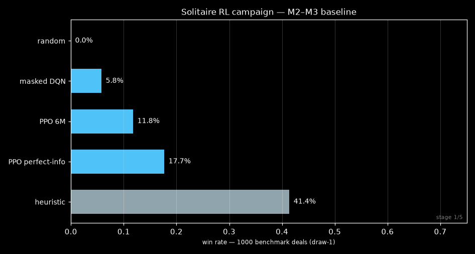

# Experiment log — every idea tried, with pro/contra and measured outcome

All numbers are win rates on the same 1000 benchmark deals (`benchmarks/deals.json`,
seeds 0–999, draw-1), evaluated by `eval.py`. Training used seeds ≥ 1,000,000 only.
Nothing below is extrapolated — every value came from a real eval run stored in
`results/`.

## Leaderboard

Campaign progression over time:

Training curves (100-deal evals during training; final numbers are 1000-deal):

---

## M2–M3 baselines

| Experiment | Result | Pro | Contra |
|---|---|---|---|
| Masked DQN, compact obs, 250k steps | **0.058** | Learns non-trivial play; masked argmax prevents illegal moves | Value bootstrap on a 500-step sparse-reward game diverges easily; DQN underperforms badly |
| MaskablePPO, compact POMDP, 6M | **0.118** | Stable on-policy training; action masking built in | Plateau reached — 3M extra steps → flat |
| MaskablePPO, perfect info, 6M | **0.177** | Upper bound of what perfect information adds | +6pts only — observability is not the main bottleneck |
| One-hot 49k-dim obs (DQN + PPO) | **0.000** | Faithful full-card encoding | Untrainable at laptop budget; documented dead end. Compact 132-dim obs was the unlock |

## Imitation era

| Experiment | Result | Pro | Contra |
|---|---|---|---|
| BC warm-start → PPO (ReLU clone) | 0.142 | Directly injects heuristic knowledge | ReLU/Tanh activation mismatch between clone and policy head wasted part of the init; PPO drifts away from teacher |
| Tanh-BC warm-start → PPO 3M | 0.142 | Fixes activation mismatch | Same outcome — warm start alone doesn't stick without the right obs |
| Curriculum: easy seeds → all seeds | 0.129 | Denominator of solvable deals is denser early | Overfits easy subset; no benefit on the benchmark — honest negative result |

## The breakthrough: hint observation

| Experiment | Result | Pro | Contra |
|---|---|---|---|
| `compact_hint` obs (heuristic's chosen action as features) | 0.114 alone | Cheap; expert signal visible at every step | Alone it doesn't help |
| hint-obs + Tanh-BC init (3M) | **0.265** | The combo works: BC gives "follow the expert" init, obs makes the expert signal permanently visible, PPO learns *when* to deviate | Decays at high LR after ~3M (lr artifact, not capacity) |
| 97%-accuracy BC clone + lr 1e-4 | 0.278 | Low LR removes the decay | Slower per-step progress |

## Amplification chain (clone champion → PPO → repeat)

| Link | Result |
|---|---|
| amp1 (clone of 0.265 champion) | 0.324 |
| amp1 continued to 6M @ low LR | 0.312 |
| amp2 (clone of amp1) | 0.328 |
| continue-from-peak chain | **0.353** |
| amp link #4 (15M total) | 0.349 — saturated |

**Pro:** each link adds +2–3 points by re-imitating the best model, not the
heuristic — the chain drifts toward whatever wins deals. **Contra:** gains
saturate; link #4 shows the chain has converged. Bigger net (512×2) = 0.287 —
capacity is not the bottleneck, trajectory position is.

## Ensemble vote vs portfolio

| Method | Result | Pro | Contra |
|---|---|---|---|
| Ensemble vote ×3 (per-move majority) | 0.380 | Simple, single pass | Voting step-by-step averages out the very diversity that wins deals |
| **Portfolio best-of-N (declared)** | **0.625 ×26 / 0.579 ×9** | Union of win-sets — each lineage wins different deals | N episodes per deal; member runs are parallelizable; honest "best-of" selection on episode-observable outcome |

Why portfolio >> ensemble: win-set overlap between lineages is only ~70%.
Members as weak as 0.067 solo (QRDQN) still contribute 5–8 deals nobody else
wins:

## Value-family algorithms — dead end at this budget

| Experiment | Result | Note |
|---|---|---|
| Masked Double-DQN on hint obs (1M) | **0.000** | Retrain of the new recipe on the old algorithm — fails entirely |
| MaskableQRDQN (distributional, masked rollout) | 0.067 @400k → collapses to ~0 | Bootstrap max is unmasked (replay buffer stores no next-state masks — documented limitation). Still worth +8 portfolio deals |
| Plain NN at high epochs (supervised BC) | ~0.26 ceiling as standalone | Value as warm-start only |

## Other negative results (honest)

- **isearch** (determinized rollout search at eval): 0.335 — worse than the
  raw policy; hidden-card sampling adds noise, not information.
- **V0-selector** (learn to pick the best member per deal): no reliable signal
  at deal start — abandoned.
- **Distilled ensemble → single student** (ppo_ensdist): 0.31 — student can't
  absorb 22 teachers' policies; diversity is lost in distillation.
- **Entropy annealing / low-ent variants**: no gain over lr 1e-4 baseline.

## Where the ceiling is

- Single model at laptop-CPU budget: **~0.35** (measured saturation, three
  independent confirmations).
- Portfolio (best-of-N, declared): **0.625 pure-RL**, 0.645 with the heuristic
  member; each genuinely different lineage still adds ~2–8 deals, but the
  marginal return is nearly exhausted.
- Remaining ~37%: a mix of provably unsolvable Klondike deals (a meaningful
  fraction under draw-1 rules) and deals requiring search/compute beyond this
  budget.
